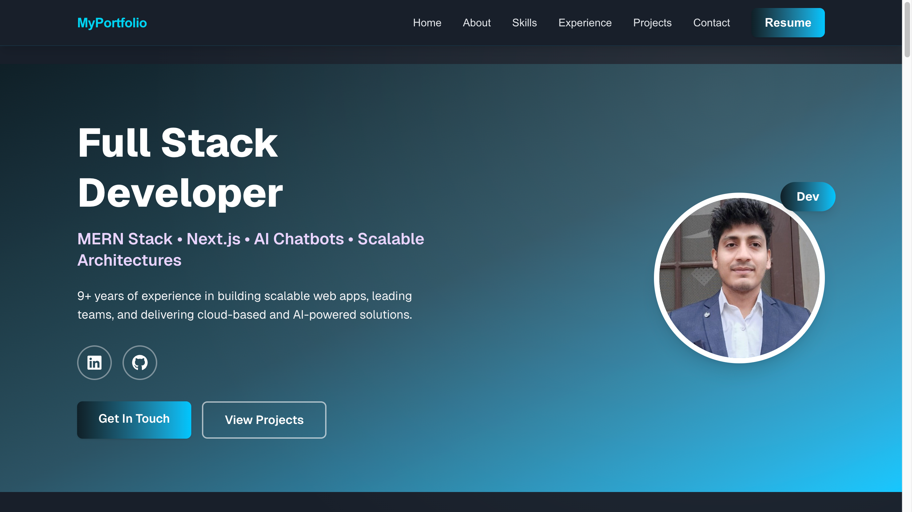
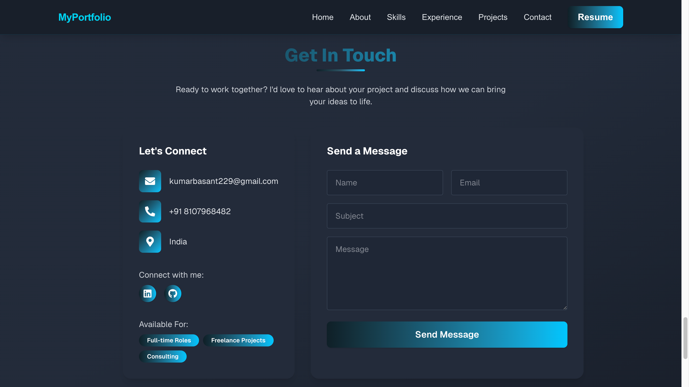

# 🧑‍💻 Basant Kumar – Developer Portfolio

This is my personal portfolio website built with **Next.js**, showcasing my skills, experience, and projects as a **Senior Full Stack Developer** with 9+ years of industry experience.

## 🔗 Live Site
[Visit Portfolio](https://portfolio.basantk.com)

---

## 🚀 Tech Stack

- **Frontend:** React, Next.js, TypeScript, Tailwind CSS
- **Backend Integration:** Node.js, Express, NestJS (planned future)
- **DevOps:** Docker, AWS, GitHub Actions
- **Database (Project References):** MongoDB, MySQL, Redis, Elasticsearch
- **Other Tools:** Dialogflow, Twilio, OAuth 2.0, CI/CD, LMS & ITSM integrations

---

## 📂 Features

- Modern UI with responsive layout
- Categorized skills (Frontend, Backend, Tools)
- Projects with tech tags and descriptions
- Professional experience timeline
- Contact form and social links (LinkedIn, GitHub, WhatsApp)

---

## 📸 Screenshots
<!-- to do later -->



---

## 🛠️ Run Locally

Clone the project:

```bash
git clone https://github.com/yadavbasant/My-Nextjs-Portfolio.git
cd My-Nextjs-Portfolio

npm install

npm run dev

Open http://localhost:3000 to view it in your browser.
